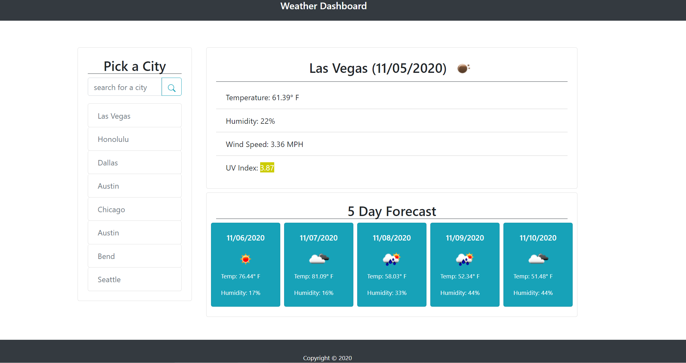

# Weather Application

## About The Repository

### Summary

This repository contains a weather application powered by Javascript, jQuery, and moment.js. This application utilizes these technologies to:

- Display the current weather in the user's chosen city.
- Display the 5 day forecast for that city.
- Save the search history in localStorage.
- Display an icon to show what the weather will be like.
- Display a color that indicates whether the UV index is favorable (green), moderate (yellow), or severe (red).

### Functionality

The application defaults to the last searched city on default based off what was saved to local storage. Once a new city is searched then that city's current weather and forecasted weather will be displayed. That city will also be saved to localStorage and the buttons will update to show the 8 most recent searched cities. When a button of the previously searched cities is clicked the weather will be updated for that city but the search history buttons will not but updated.

## Website Mock

Website URL: https://jrkrichards.github.io/Weather_Application/

### Weather Application:

Start:

New City Searched:

